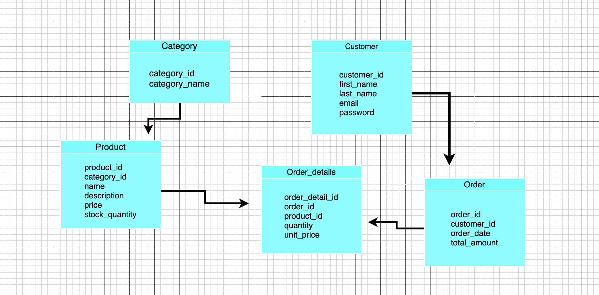

# 🛒 E-Commerce Platform

# Create Database — Schema Description

The database represents a simple e-commerce system for managing products, customers, and orders.
It consists of five main entities:

---

## Entities

### 1. Category

* `category_id` (PK)
* `category_name`

Stores product categories such as electronics, clothes, or accessories.
One category can contain multiple products.

---

### 2. Product

* `product_id` (PK)
* `category_id` (FK → Category.category_id)
* `product_name`
* `product_description`
* `price`
* `stock`

Represents the items available for sale. Each product belongs to one category.

---

### 3. Customer

* `customer_id` (PK)
* `first_name`
* `last_name`
* `email` (UNIQUE)
* `password`

Contains customer information. A customer can place multiple orders.

---

### 4. Orders

* `order_id` (PK)
* `customer_id` (FK → Customer.customer_id)
* `order_date`
* `total_amount`

Represents a customer’s purchase transaction. Each order can contain multiple products.

---

### 5. Order_Details

* `order_detail_id` (PK)
* `order_id` (FK → Orders.order_id)
* `product_id` (FK → Product.product_id)
* `quantity`
* `unit_price`

Junction table connecting orders with products. Stores each product line in an order, including quantity and unit price. Resolves the many-to-many relationship between Orders and Products.

---

## SQL Schema

```sql
CREATE TABLE IF NOT EXISTS Category (
    category_id SERIAL PRIMARY KEY,
    category_name VARCHAR(100) NOT NULL
);

CREATE TABLE IF NOT EXISTS Product (
    product_id SERIAL PRIMARY KEY,
    category_id INT NOT NULL REFERENCES Category(category_id),
    product_name VARCHAR(100) NOT NULL,
    product_description TEXT,
    price NUMERIC(10,2) NOT NULL,
    stock INT NOT NULL
);

CREATE TABLE IF NOT EXISTS Customer (
    customer_id SERIAL PRIMARY KEY,
    first_name VARCHAR(100),
    last_name VARCHAR(100),
    email VARCHAR(150) UNIQUE NOT NULL,
    password VARCHAR(200) NOT NULL
);

CREATE TABLE IF NOT EXISTS Orders (
    order_id SERIAL PRIMARY KEY,
    customer_id INT NOT NULL REFERENCES Customer(customer_id),
    order_date TIMESTAMP DEFAULT NOW(),
    total_amount NUMERIC(10,2) NOT NULL
);

CREATE TABLE IF NOT EXISTS Order_Details (
    order_detail_id SERIAL PRIMARY KEY,
    order_id INT NOT NULL REFERENCES Orders(order_id),
    product_id INT NOT NULL REFERENCES Product(product_id),
    quantity INT NOT NULL,
    unit_price NUMERIC(10,2) NOT NULL
);
* create a sale hitory

CREATE TABLE Sale_History (
    sale_id INT PRIMARY KEY AUTO_INCREMENT,
    order_id INT NOT NULL,
    customer_id INT NOT NULL,
    product_id INT NOT NULL,
    order_date DATETIME NOT NULL,
    quantity INT NOT NULL,
    total_amount DECIMAL(10,2) NOT NULL,
    created_at TIMESTAMP DEFAULT CURRENT_TIMESTAMP,

    CONSTRAINT fk_sale_order
        FOREIGN KEY (order_id) REFERENCES `Order`(order_id),

    CONSTRAINT fk_sale_customer
        FOREIGN KEY (customer_id) REFERENCES Customer(customer_id),

    CONSTRAINT fk_sale_product
        FOREIGN KEY (product_id) REFERENCES Product(product_id)
);
```

---


## Entity Relationships

1️⃣ **Category → Product** — One-to-Many

* A category can have multiple products.
* Each product belongs to one category.

2️⃣ **Customer → Orders** — One-to-Many

* One customer can place many orders.
* Each order belongs to a single customer.

3️⃣ **Order ↔ Product (via Order_Details)** — Many-to-Many

* An order can contain multiple products.
* A product can appear in multiple orders.
* `Order_Details` stores this relationship with quantity and unit price.

4️⃣ **Order → Order_Details** — One-to-Many

* Each order consists of multiple order details.

5️⃣ **Product → Order_Details** — One-to-Many

* A product can appear in multiple order detail records.

---

## ERD Diagram



---

## Sample Queries

```sql
-- Get order details for a specific date
SELECT od.unit_price, o.order_date
FROM Orders o
INNER JOIN Order_Details od ON o.order_id = od.order_id
WHERE o.order_date = '2003-02-02';

-- Total quantity per product for Feb 2003
SELECT od.product_id AS od_product,
       SUM(od.quantity) AS total_quantity
FROM Order_Details od
JOIN Orders o ON od.order_id = o.order_id
WHERE EXTRACT(MONTH FROM o.order_date) = 2
  AND EXTRACT(YEAR FROM o.order_date) = 2003
GROUP BY od.product_id
ORDER BY total_quantity DESC;

-- Customers with orders over $500 in the past month
SELECT c.first_name || ' ' || c.last_name AS customer_name,
       SUM(o.total_amount) AS total_order_amount
FROM Customer c
JOIN Orders o ON c.customer_id = o.customer_id
WHERE o.order_date >= date_trunc('month', CURRENT_DATE) - INTERVAL '1 month'
  AND o.order_date < date_trunc('month', CURRENT_DATE)
GROUP BY customer_name
HAVING SUM(o.total_amount) > 500
ORDER BY total_order_amount DESC;
---
### Observation
The difference is not significant in this case because the dataset size (10,000 rows) is relatively small.
With much larger datasets, the performance gap would be more noticeable.

### Optimization Technique
A B-Tree Index was created (PostgreSQL default).
It is efficient for JOIN operations and equality checks (e.g., WHERE x = y).

---

## task session "5"
* Automatically Record Sales History on New Order Creation
```sql
CREATE OR REPLACE FUNCTION sync_sale_history()
RETURNS TRIGGER
LANGUAGE plpgsql
AS $$
BEGIN
    INSERT INTO sale_history (
        order_id,
        order_date,
        customer_id,
        product_id,
        quantity,
        total_amount
    )
    SELECT
        NEW.order_id,
        o.order_date,
        o.customer_id,
        NEW.product_id,
        NEW.quantity,
        NEW.quantity * NEW.unit_price
    FROM orders o
    WHERE o.order_id = NEW.order_id;

    RETURN NEW;
END;
$$; 
 * in the product table
Write a transaction query to lock the field quantity with product id = 211 from being updated
Write a transaction query to lock row with product id = 211 from being updated
``` sql 
'1'
BEGIN 
SELECT quantity
 FROM product
 WHERE product_id = 211
 FOR UPDATE;
 COMMIT
 
'2'
BEGIN 
SELECT *
 FROM product
 WHERE product_id = 211
 FOR UPDATE;
 COMMIT
```
---

## Denormalization Strategies

1. **Add redundant fields in Orders**

* Store customer details (name, email) directly in Orders for faster reporting.
* Trade-off: Redundancy and need to update Orders when customer info changes.

2. **Create summary/aggregate tables**

* Example: `customer_orders_summary` with total orders and total amount.
* Trade-off: More complex insert/update logic.

3. **Pre-join frequently accessed data**

* Create denormalized tables combining Customers and Orders for dashboards or reports.

** Summary:** Denormalization improves read/query performance but increases storage and complexity in writes/updates.

## task section 7

## Task 5: Retrieve Total Number of Products in Each Category

In this task, we are dealing with a large amount of data. The goal is to calculate the number of products available within each specific category.

We analyzed two approaches to solve this:

1.  **Using INNER JOIN:** This method only returns categories that strictly contain products. If a category is empty (has no products), it will be excluded from the results, which might lead to incomplete data reporting.
    
2 **Using LEFT JOIN (Selected Approach):** This is the preferred method. It returns **all** categories from the `Category` table. If a category has no products, it will still appear in the result with a count of `0`.

### Solution Query:
```sql
SELECT c.category_name, COUNT(p.product_id)
FROM Category c
LEFT JOIN Product p ON c.category_id = p.category_id
GROUP BY c.category_name;

### Performance Analysis (Task 5)

I used `EXPLAIN ANALYZE` to measure the execution time before and after optimization.

**Results:**
* **Before Indexing:** Execution Time ≈ 6.906 ms
* **After Indexing:** Execution Time ≈ 6.670 ms

```sql
CREATE INDEX idx_product_category ON Product(category_id);
```
<!--task table  -->
## 5. Revenue Generated per Product Category:
| Simple Query | Execution time before optimization | Optimization Technique | Rewrite Query | Execution time after optimization |
| :--- | :--- | :--- | :--- | :--- |
| `SELECT c.category_name, COUNT(p.product_id) FROM Category c LEFT JOIN Product p ON c.category_id = p.category_id GROUP BY c.category_name;` | ≈ 6.906 ms | **Indexing:** <br> `CREATE INDEX idx_product_category ON Product(category_id);` | `SELECT c.category_name, COUNT(p.product_id) FROM Category c LEFT JOIN Product p ON c.category_id = p.category_id GROUP BY c.category_name;` | ≈ 6.670 ms |

## Task 6: SQL Query to Find Top Customers by Total Spending
### Solution Query:

```sql

SELECT c.customer_id,
    c.first_name,
    c.last_name,
    SUM(o.total_amount) AS total_spent
FROM Customer c
JOIN Orders o ON c.customer_id = o.customer_id
GROUP BY c.customer_id, c.first_name, c.last_name
ORDER BY total_spent DESC
LIMIT 10;
```
---
## Task 7: SQL Query to Retrieve Most Recent Orders with Customer Information
### Solution Query:

```sql
SELECT o.order_id,
    o.order_date,
    o.total_amount,
    c.customer_id,
    c.first_name,
    c.last_name
FROM Orders o
JOIN Customer c ON o.customer_id = c.customer_id
ORDER BY o.order_date DESC
LIMIT 1000;
```
<!-- task8 -->
## Task 8:SQL Query to List Products with Low Stock Quantities of less than 10 quantites?

### Solution Query:
```sql
SELECT
    p.product_id,
    p.name AS product_name
FROM
    Product p
WHERE
    p.stock < 10
ORDER BY
    p.stock ASC;
 ```
 ---

 <!--task9  -->
## Task 9 :Write SQL Query to Calculate Revenue Generated from Each Product Category?

### Solution Query:
```sql 
SELECT c.category_name, SUM(p.price *p.stock) AS total_revenue
FROM Category c
LEFT JOIN Product p ON c.category_id = p.category_id
GROUP BY c.category_name
ORDER BY  total_revenue DESC;
```
### Performance Analysis (Task 9)
```sql
CREATE INDEX idx_product_revenue ON Product ((price * stock))
 you maaust used  ((price * stock)) double parentheses
```
I used `EXPLAIN ANALYZE` to measure the execution time before and after optimization.
 **Results:**
* **Before Indexing:** Execution Time ≈ 11.227 ms
* **After Indexing:** Execution Time ≈ 10.283 ms

You can use a "MATERIALIZED VIEW" if the data does not change frequently, but in this case,
 the product stock changes constantly, 
---


## 9. Revenue Generated per Product Category:
| Simple Query | Execution time before optimization | Optimization Technique | Rewrite Query | Execution time after optimization |
| :--- | :--- | :--- | :--- | :--- |
| `SELECT c.category_name, SUM(p.price * p.stock) AS total_revenue FROM Category c LEFT JOIN Product p ON c.category_id = p.category_id GROUP BY c.category_name ORDER BY total_revenue DESC;` | ≈ 11.227 ms | **Functional Indexing:** <br> `CREATE INDEX idx_product_revenue ON Product ((price * stock));` | `SELECT c.category_name, SUM(p.price * p.stock) AS total_revenue FROM Category c LEFT JOIN Product p ON c.category_id = p.category_id GROUP BY c.category_name ORDER BY total_revenue DESC;` | ≈ 10.283 ms |